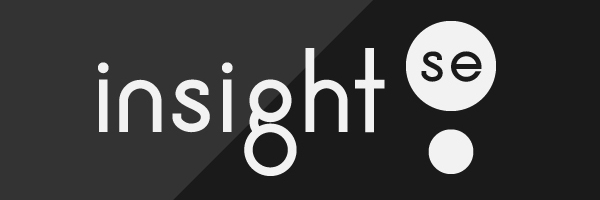

<h1 align="center">
    
</h1>

  :white_check_mark: <a href="https://andreadcsousa.github.io/rocketseat_nlw7_origin/" target="_blank">Veja a página</a>&nbsp;&nbsp;&nbsp;|&nbsp;&nbsp;&nbsp;
  :white_check_mark: <a href="https://rocketseat.com.br/" target="_blank">Conheça a Rocketseat</a>

# :computer: Projeto
 
- Idealizador: Rocketseat
- Projeto: NLW Heat
- Lado da força: Front-End
- Tipo: Next Level Week 7
- Etapa: Desafio Origin

# :rocket: Tecnologias

Esse projeto foi desenvolvido com:

Integrou o projeto:

# :iphone: Layout Mobile

